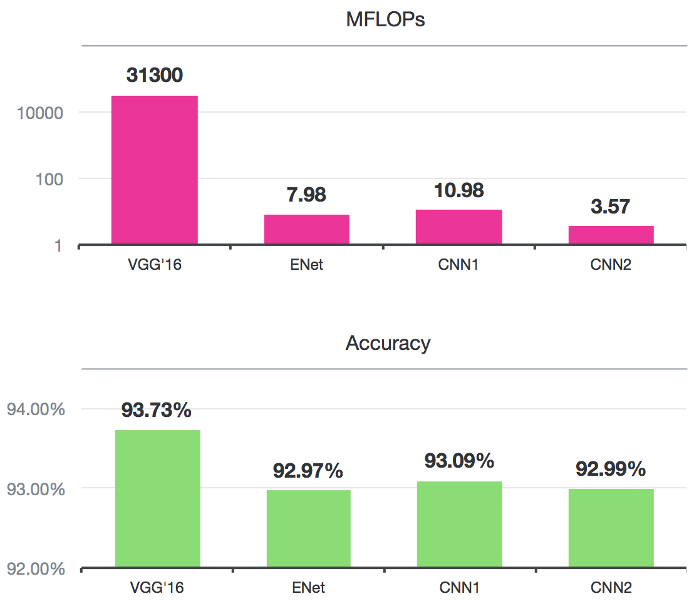

# AI-Case-Study

## Overview and Origin

* Affectiva is artificial intelligence software development company that specializes in processing human emotions and cognitive states by analyzing facial and vocal expressions.
  
* Affectiva was incorporated in 2009 by founders Dr. Rana el Kaliouby and Dr. Rosalind Picard as a spin out of the MIT Media Lab. It was acquired by Smart Eye on May 25,th 2021 for $73.5 million [^1]

* The company was founded on the idea or principle of humanizing technology to improve the interaction or experience between humans and machines. 

* Affectiva was provided with $53 million in funding by the following venture capital investors: Kleiner Perkins Caufield Byers, Horizon Ventures, Fenox Venture Capital, and WPP [^2]

## Business Activities

* The world is now saturated with smart devices and advanced AI systems, which have afforded humanity amazing cognitives achievements. Unfortunately, most of these technologies don't always provide humanity same potential for advancement in emotional intelligience (EQ). Affectiva's goal is to solve the problem that has created a gap between IQ and EQ by designing the AI systems that can create empathetic interactions with humans.

* The benefits of imbuing AI with emotional intelligence are applicable in many different fields; however Affectiva's targeted base is consumers in the automotive saftery, advertising, entertainment and participants in quality research in person and online. Affectiva reports utilizing a global dataset of over 14 million videos collected from 90 countries. Their Media Analytics solutions are used by 90 percent of the world's largest advertisers, and 26 percent of Fortune Global 500 companies.

* A key component that makes Affectiva's approach to Emotion AI unique stems from the cofounder Rana el Kaliouby's desire to utilize "Affective Computing" to help individuals with autism improve communication by providing tools to assist with understanding our sensory world prior to the inception of the company.[^3] Similar to Affectiva, many other Emotion AI companies implement complex multi-modal deep learing and generative systems to capture emotion through a variety of methods including facial expressions, tone of voice, environmental factors, social setting, and cultural context. However, in reference to the Kaliouby's initial interest in the autistic community. Affectiva differs by placing the desire to improve communication at the center their Emotion AI systems approach.[^4] [^5]

* Machine Learning Models based on Deep Learning are the primary technological approaches Affectiva uses to capture human emotion through artificial intelligence. Some primary ways human emotion and cognitive states are expressed are through facial expressions and vocal tonality. There is a large variety human expreession and tones of voice. In addition, these expressions or tones are constantly changing or adapting to new stimuli. This creates a complex problem that require a less straightfoward algorithm that uses deep neural networks to analye this evolvoing data and solve the problem of classifying, segmenting, modeling by automatically extracting features of the data to guide the learning process. Affectiva uses the following two deep learning architectures to accomplish this task:
  
  1. Convolutional Neural Networks (CNN)
     - Multi-task (multi-attribute) networks for both regression and classification
     - Region proposal networks
  2. Recurrent Neural Networks (RNN)
     - Long Short-Term Memory (LSTM)
     - Deep Recurrent Non-Negative Matrix Refractorization (DR-NMF)
     - CNN + RNN nets [^6]

## Landscape

* Emotion AI is a subcategory with the field of the Facial and Speeech Recognition Recognition Technology popular in culture first through science fiction movies but more notably through the advent of smart phones, smart homes, and voice assistants.

* Facial Recognition Systems a based on proprietary algorithms that perform three basic funtions:
  1. Detection - process of finding a face, not necessarily an identity.
  2. Analysis - maps the face by measuring eyes, shape of chin, distance between nose and mouth, and then            converts that into a string of numbers or points to create a "faceprint".
  3. Recognition - the attempt to verify a person's identity for security purposes.[^7]
 
* Speech Recognition Systems are also based on various algorithms and computation techniques to recognize speech and turn it into an accurate text transcript. Here are a list of the some of the methods used:
  1.  Natural Language Processing (NLP) - interaction between humans and machines through speech and text.
  2.  Hidden Markov Models - allows coders to incorporate part-of-speech tags into a probabilistic model. Each        sequenced model within speech recognition is assigned a label for further mapping and the determination         of the appropriate label sequence.
  3.  N-grams - assigns probability to sentences or phrases.
  4.  Neural Networks - mimics the interconnectivity of the human brain through layers of nodes. Each node is         made up of inputs, weights, a bias, and an output. If output exceeds a given threshold, it "fires" or           activates the node, passing data to next layer in the network.
  5.  Speaker Diarization - an algorithm identifies and segments speech by speaker identity.[^8]

  * Below is an example of OpenAI's Whisper, an open-source automatice speech recognition model that shows how large and diverse datasets containing multiple languages and tasks are transcribed into text by an end-to-end approach using an encoder-decoder transformer:
 
  ![OpenAI Speech Processing]( ^9]

      
 * Common trends in the field of Emotion AI have been utilizing this sensory data to better understand and predict human behaviors. These types of analytics are in high demand for advertising/retail, entertainment content, automotive safety, and behavioral research for humans and animals. Two other major companies in this field include Realeyes, Noldus, and Cognovi Labs.[^10]

## Results

* Affectiva has had a major impact on the automotive safety, advertising and entertainment business, where success is based on a companies ability to tell the story about their brand that will resonate with consumers. Affectiva has been at the forefront of providing organizations with a way to measure and gauge large data sets comprised of audiences and consumers' feel or react to the specific content. This insight can then be used to improve brand experiences and communications which will better the connection with customers and impact the financial bottom line.

* Accuracy and real time estimates of emotions are some of the metrics at the core of Affectiva's deep learning models, in order to provide useful insight on brands and content. Their approach to speed and accuracy involves the following:
  -  Joint-training with shared layers between models (multi-tasking learning)
  -  Iterative benchmarking/profiling of on-device performance
  -  Model compression: training compact models from larger models
 
  

* Affectiva solutions and products are comparable to other Emotion AI companies, particurly in the categories of Visual and Conversation AI. Their software provides facial coding, eye tracking, emotion recognition, audio tonality, text sentiment, custom reporting, and a customer engagement score.[^11]

## Recommendations

* As a consultant or advisor it is always a challenge to determine how well a software integrates with another application, and given the complexity of the Affectiva's multi-modal emotion perception system, I would love to see more information on the company's API metrics. Along with this information, offering additional products or services to assist integration would make this services by feasible for organizations the lack a robust technology department. Affectiva has already rolled out a Software Development Kit (SDK) which provides the technology needed to assist developers with integrating technology onto apps and browsers.[^12] Increasing the accessibility of SDKs would further the exploration of how emotion analytics can help facilitate humanity's desire to create meaningful social interactions and connections in this new digital frontier.
___
[^1]: https://www.businesswire.com/news/home/20210525005790/en/Smart-Eye-Acquires-Affectiva-to-Solidify-Stronghold-on-Interior-Sensing-Market 
[^2]: https://www.affectiva.com/about-affectiva/
[^3]: https://www.media.mit.edu/groups/affective-computing/overview/
[^4]: https://koablog.wordpress.com/2015/10/20/an-origin-story-affectiva/
[^5]: https://pubmed.ncbi.nlm.nih.gov/17312261/
[^6]: https://www.affectiva.com/deep-learning/
[^7]: https://www.nytimes.com/wirecutter/blog/how-facial-recognition-works/
[^8]: https://www.ibm.com/topics/speech-recognition
[^9]: https://openai.com/research/whisper
[^10]: https://www.ventureradar.com/keyword/Emotion%20AI
[^11]: https://deepanshugahlaut.medium.com/top-emotion-ai-companies-to-watch-out-for-in-2023-db925868fd9f
[^12]: https://www.affectiva.com/news-item/affectiva-launches-an-sdk-to-bring-emotion-tracking-to-mobile-apps/

